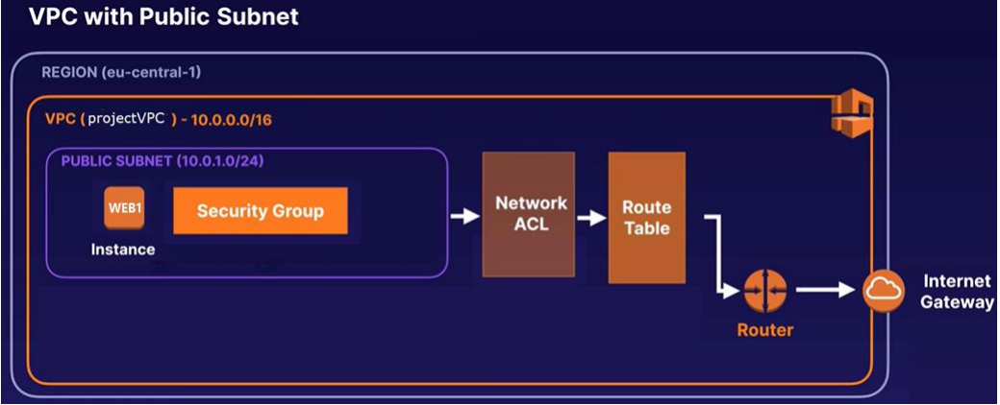

### Terraform Labs Assignment 2

 - Create a Custom VPC with EC2 Instance.
 - The VPC should have a CIDR block of 10.0.0.0/16
 - The VPC should contain a public subnet with a CIDR block of 10.0.1.0/24
 - The VPC should contain a NACL, RT, Router and Internet Gateway with an Elastic IP
 - The Public Subnet should contain a security group allowing port 80 for HTTP
 - The EC2 Instance should have a bootstrap script to install httpd and set up the index.html
 
 Diagram: 
 
 